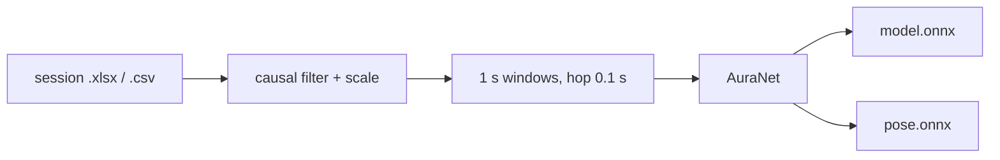

# Aura hand EMG

Baseline pipeline for the Aura hand-EMG Kaggle competition. Aura is an 8-channel surface-EMG wristband ([aura.pieeg.com](https://aura.pieeg.com/)). One session file in, one ONNX model out. Two targets from the same recordings.

`Python 3.12` · `250 Hz` · `8 ch` · `window 1.0 s` · `ONNX`

| Target | Command | Graph | Output |
| --- | --- | --- | --- |
| Gesture, 6 class | `python train.py` | `model.onnx` | softmax: rest, fist, open, pinch, point, thumb-up |
| Hand pose, 7 DoF | `python train.py --pose` | `pose.onnx` | `[0, 1]`: five finger curls, pinch, openness |

This directory is the working tree. Run every command from here. Training index: [research_log.md](research_log.md).

> Filter, per-channel scale, and the 0.5 s warmup live **outside** the graph. Do not feed raw microvolts to ONNX. Copy `infer.py`.



## Index

| | Section | Contents |
| --- | --- | --- |
| ⚡ | [Quick start](#quick-start) | venv, first train |
| ⌨️ | [Commands](#commands) | train, pose, loso, infer |
| 📁 | [Data](#data) | columns, labels, pose targets |
| ⚙️ | [Method](#method) | filter, windows, QC, AuraNet |
| 🤚 | [Pose regression](#pose-regression) | 7-DoF optical target |
| ✂️ | [Split](#split) | session-level, LOSO |
| 💻 | [Hardware](#hardware) | CPU vs T4 |
| 📦 | [Run artifacts](#run-artifacts) | `runs/<timestamp>/` |
| 🔌 | [Inference contract](#inference-contract) | `model.onnx` I/O |
| 📏 | [Pose inference contract](#pose-inference-contract) | `pose.onnx` I/O |
| 🗂️ | [Layout](#layout) | files |
| 🔧 | [Configuration](#configuration) | `config.yaml` |

## Quick start

Python 3.12.

```powershell
py -3 -m venv .venv
.\.venv\Scripts\Activate.ps1
pip install -r requirements.txt
```

Put one file per session in `data/raw/` (`.xlsx` or `.csv`). Then:

```powershell
python train.py --qc-only
python train.py
python infer.py
```

Dependencies: NumPy, pandas, openpyxl, SciPy, PyYAML, PyTorch, ONNX, ONNX Runtime.

`--qc-only` writes the channel table and does not train. `--self-test` trains for one epoch on synthetic tensors and checks that the ONNX file loads. It does not read `data/raw/`.

## Commands

| Command | What it does |
| --- | --- |
| `python train.py --qc-only` | Channel QC only. No fit. |
| `python train.py` | 6-class classifier → `model.onnx` |
| `python train.py --pose` | 7-DoF pose regressor → `pose.onnx` |
| `python train.py --data D:\more-sessions` | Read sessions from another folder |
| `python train.py --test multimodal_15` | Pin the test session |
| `python train.py --loso` | Leave-one-session-out on train+val. Test stays sealed. Does not replace `model.onnx` |
| `python train.py --self-test` | One synthetic epoch. No `data/raw/` |
| `python infer.py` | One-window ONNX caller (latest `model.onnx`) |
| `python infer.py runs\RUN\model.onnx` | Same, explicit graph |

## Data

Place one file per session in `data/raw/`. Accepted formats are `.xlsx` (first sheet) and `.csv`. Excel lock files (`~$*`) are ignored.

| Column | Role |
| --- | --- |
| `t` | Time in seconds from session start |
| `emg_new` | If present, only rows with value 1 are kept |
| `ch1` … `ch8` | EMG in microvolts |
| `label` | Class name |
| `label_source` | If present, only `guided` rows are labeled. Other rows are unlabeled |
| `optical_*` | Optical tracker metadata. Not a classifier input. See `drop_optical_disagreement` |
| `thumb_curl` … `pinky_curl`, `pinch`, `openness` | Continuous pose in `[0, 1]`. The `--pose` target, not an input |

IMU columns (`ax`, `ay`, `az`, `gx`, `gy`, `gz`, `roll`, `pitch`, `yaw`) are not read. Class names are normalized (`open hand` → `open`, `thumb up` → `thumb-up`). Anything outside the six-class list is unlabeled.

Recordings are not part of the repository. `data/raw/` is gitignored except for its note.

If `data/raw/` is empty, `fallback_data_dir` in `config.yaml` is used when that path exists.

## Method

Sampling rate is 250 Hz. Files more than 2% off that rate are resampled. The first 0.5 s after filtering is dropped as filter warmup.

Preprocessing, applied before the network and not inside the ONNX graph:

1. Causal bandpass 20–120 Hz, order 4.
2. Causal bandstop 45–55 Hz, order 4.
3. Causal notch at 100 Hz, Q = 30.
4. Per-channel scale `median(|x|) / 0.6745`, with a floor of `1e-6`.

Windows are 1.0 s (250 samples) with a hop of 0.1 s. Samples within 0.2 s of a label change are unlabeled, so ramp intervals are not used as holds. A window is kept when at least 90% of its samples share one class and no second class is present.

Channel QC, per file, on the filtered signal:

- Drop if the channel is empty, flat (std < 1 µV or peak-to-peak < 2 µV), railed, or listed in `drop_channels`.
- Report SNR of active grips versus rest, and the fraction of 20–120 Hz power in the 49–51 Hz band. Low SNR is not an automatic drop.
- A channel is zeroed in the shipped graph only if it hard-fails in at least `global_drop_fraction` of the train files, or it is listed in `drop_channels`. The mask is estimated from the train files only, so neither validation nor test decides which channels exist.

The network is a temporal-spatial convolutional classifier (time convolution, depthwise mix across the 8 channels, separable convolution, linear head). Input layout is `(batch, time, channels)`. Output is a softmax over the six classes, index 0 = rest. Training uses class-weighted cross-entropy and AdamW. Early stopping watches validation balanced accuracy.

## Pose regression

`python train.py --pose` trains a continuous hand-pose regressor on the same recordings and the same windows. The target is the optical hand tracker carried in each session file: seven values in `[0, 1]`, the five per-finger curls plus pinch and openness. This is an optical estimate, not motion capture, so the model distils that tracker into EMG and its ceiling is the tracker's own quality.

The target for a window is the confidence-weighted median pose over that window. A window is used when at least half its samples carry a present, valid pose and the median optical confidence clears `pose_min_conf`. Loss is Smooth L1 weighted by confidence, and early stopping watches validation mean absolute error. The network reuses the classifier backbone with a sigmoid head, so the output is a pose vector in `[0, 1]`. Reported metrics are per-DoF MAE and Pearson correlation on the test sessions.

## Split

The split unit is the session file. Windows from one file are not placed on both sides of a split: the hop is 100 ms inside a 1 s window, so neighboring windows are the same contraction.

With the session lists in `config.yaml` empty, files are shuffled with `seed` and cut by `test_fraction` and `val_fraction` (default 20% test, 20% validation, remainder train). At least one file is required in each role, and at least three files are required in total.

| Role | Use |
| --- | --- |
| Train | Weight updates |
| Validation | Early stopping only |
| Test | One score after training. Not in the loss, not in early stopping, not in the exported weights |

`runs/<timestamp>/split.json` is the assignment from that run. Copy it into `train_sessions`, `val_sessions`, and `test_sessions` to freeze the split. Files that are not listed are appended to train.

`--loso` runs leave-one-session-out on train and validation only. It does not score or modify the test files, and it does not replace `model.onnx`.

The reported test metric is balanced accuracy. Rest is the majority class, so unweighted accuracy is not the selection metric.

## Hardware

AuraNet is a small temporal-spatial CNN (8 channels, 1 s window). One `python train.py` run is fine on CPU. `--loso` is 12 extra trains on the train+val sessions (test stays sealed), each for the shipped epoch count, so it is slow on CPU. The network is not large; a free T4 is enough.

| Budget | Where | Notes |
| --- | --- | --- |
| $0 | Kaggle notebook, GPU on | ~30 GPU hours/week. Best free option for this competition. |
| $0 | Colab, Runtime > GPU (T4 if assigned) | Works. GPU is not guaranteed. Idle disconnect. [notebooks/loso.ipynb](notebooks/loso.ipynb) |
| $0 | This machine, CPU | Single train: yes. LOSO: hours. Do not start it here. |
| ~$1 | Any rented T4 / RTX, SSH | One LOSO job. |

Do not `pip install torch` on Colab or Kaggle. Those runtimes already ship CUDA PyTorch; a pip torch often replaces it with CPU. Install the rest from `requirements.txt`. Session files are ~104 MB and are not in git: put them in `data/raw/` (upload, Drive, or Kaggle dataset). `loso.json` is written after each fold so a dropped session still keeps completed scores.

## Run artifacts

Each training writes `runs/<timestamp>/`. `runs/latest.txt` stores that path.

| File | Contents |
| --- | --- |
| `split.json` | Train, validation, and test session names |
| `qc.md`, `qc.json` | Per-session channel std, SNR, mains ratio, keep/drop |
| `report.md`, `report.json` | Train counts, validation score, test score, test confusion matrix |
| `model.onnx` | Exported network. Weights from the train split only |
| `model.pt` | PyTorch checkpoint, same weights, plus the split and channel mask |
| `contract.json` | Inference contract below |
| `pose.onnx` | Pose regressor. Present only after `--pose` |
| `pose.pt` | Pose checkpoint, plus DoF names, split, and channel mask. `--pose` only |
| `pose_contract.json`, `pose_report.md`, `pose_report.json` | Pose contract and scores. `--pose` only |
| `loso.json` | Present only after `--loso` |

## Inference contract

`contract.json` is authoritative for a given run. Defaults:

| Field | Value |
| --- | --- |
| Input name | `emg` |
| Input | `float32`, `[batch, 250, 8]`, time then channel |
| Output name | `probs` |
| Output | `float32`, `[batch, 6]`, sums to 1 |
| Class order | `rest`, `fist`, `open`, `pinch`, `point`, `thumb-up` |
| Sample rate | 250 Hz |
| Graph contents | Classifier only. Filter, scale, and warmup are the caller's responsibility |
| Channel mask | Zeroed inside the graph. See `channel_keep` |

```powershell
python infer.py
python infer.py runs\RUN\model.onnx
```

`infer.py` loads `model.onnx`, runs a mock 1 s buffer through the same causal filter and per-channel scale as training, and prints class probabilities. With no path it uses `runs/latest.txt` if that run has `model.onnx`, otherwise the newest `runs/*/model.onnx`.

The mock buffer is synthetic EMG in microvolts. Scale is computed on that 1 s window; training uses the full recording. A live caller should keep SOS filter state across hops instead of re-applying the 0.5 s warmup every window.

## Pose inference contract

`pose_contract.json` is authoritative for a `--pose` run. Defaults:

| Field | Value |
| --- | --- |
| Input | `float32`, `[batch, 250, 8]`, time then channel |
| Output name | `pose` |
| Output | `float32`, `[batch, 7]`, each value in `[0, 1]` |
| DoF order | `thumb_curl`, `index_curl`, `middle_curl`, `ring_curl`, `pinky_curl`, `pinch`, `openness` |
| Target source | Optical hand tracker, not motion capture |
| Preprocess | Same causal filter and per-channel scale as the classifier, applied by the caller |

## Layout

```
config.yaml          training and split configuration
train.py             entry point
infer.py             one-window ONNX caller (filter and scale outside the graph)
aura_pipeline/       load, QC, windows, model, fit, export, pose
research_log.md      training index
data/raw/            session files
runs/                outputs, gitignored
```

## Configuration

All knobs are in `config.yaml`. Do not hard-code channels, epochs, or split lists in Python.

`drop_optical_disagreement` defaults to false. Optical fields are last-value holds on the EMG time base, so a sample-level veto is not a reliable label. When enabled, a guided sample is unlabeled if `optical_present` is set, `optical_conf` is at least `optical_conf_min`, and `optical_class` names a different class. The pair rest/open is exempt.

`pose_targets`, `pose_min_conf`, and `pose_loss_beta` configure the `--pose` regressor: the DoF columns to predict, the median-confidence floor for keeping a window, and the Smooth L1 transition point.
